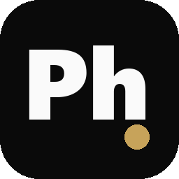

# Prompt Help

> 跨项目沉淀提示词 · 系统记忆 · 项目踩坑点
> 私有第二大脑——用 LLM 把项目化提示词通用化成可分享模板



**为谁做的**：同时维护 5+ 项目的 vibecoder（每天用 Claude Code / Cursor / Codex 等）。

**解决什么**：
- 好提示词散落在 N 个项目的 CLAUDE.md / 聊天记录里，找不到、不能跨项目复用
- 项目踩过的坑，下个项目还会再踩
- 写过一句"项目专属"提示词，给别人 / 给新项目时要全部重写
- Memory 是单会话级别、CLAUDE.md 越长越糟

---

## 核心能力

| 维度 | 能做的 |
|------|--------|
| **挖掘** | 自动扫 Claude Code / Codex 历史会话识别可复用提示词；扫本机所有项目的 CLAUDE.md / AGENTS.md / .cursorrules |
| **库** | 三类组织——通用模板 / 原始材料 / 待审。SQLite FTS5 全文检索 + trending 排序 |
| **通用化** | LLM 把项目专属提示词抽象成 `[占位符]` 模板（核心创新） |
| **占位符** | 复制带 `[占位符]` 的模板时弹小表单填值再入剪贴板；支持 `[[ref]]` 引用展开 |
| **产品发现** | LLM 苏格拉底反问引导思考产品需求，自动生成 brief / user stories / risks / decisions 四件套 |
| **协作** | 一键导出 ZIP 分享给朋友；支持增量包；冲突解决 UI；订阅朋友的 git 仓库自动 pull 到待审 |
| **Claude Code 集成** | SessionStart 自动召回相关提示词；UserPromptSubmit 触发词踩坑提醒；Stop hook 自动捕获 |
| **跨设备** | git 私仓同步；启动时检测 cwd 自动切到对应项目历史 |
| **刷新** | 「⟳ 刷新本机项目」一键同步所有项目最新内容到库（新增/更新/跳过） |

---

## 安装

### 方式 A：双击 .exe（推荐）

下载 `PromptHelp_Setup.exe`（用 Inno Setup 打包，~25MB），双击安装。会自动建桌面快捷方式 + 开始菜单入口 + 卸载入口。

### 方式 B：从源码

```bash
git clone <repo>
cd "Prompt help"
pip install -e ".[gui]"

# 跑 GUI
python -m prompt_help.gui

# 或装 CLI
prompt-help --help
```

### 方式 C：自己打包 .exe

```bash
pip install pyinstaller
python assets/make_icon.py          # 生成图标（黑底圆角 + Ph 字 + 金色高光）
pyinstaller prompt_help.spec        # 产物 dist/PromptHelp.exe（~67MB）
# 可选：用 Inno Setup 编译 assets/installer.iss 产出 setup.exe
```

---

## 快速开始（首次启动 5 分钟）

1. **首次打开** → Wizard 自动跑：填可选的 LLM API key（DeepSeek 默认）+ 选项目根目录扫描
2. **首页「上手 5 步」清单**带你走一遍：配 LLM / 加第一条 / 搜一次 / 装插件 / 试产品发现
3. **侧边栏 6 个 tab**：首页 / 我的库 / 推荐库 / 产品发现 / 统计 / 帮助 + 右上角设置 / 关于

### 日常工作流

- **写代码时**：在 Claude Code 里跑 `/prompt-recall <关键词>` → PH 自动召回该项目相关 prompt
- **写完一个新提示词**：Stop hook 自动询问"是否保存？"
- **想复用某条到新项目**：右键「⚡ 生成通用模板」→ LLM 把项目名 / 路径抽象成 `[占位符]` → 双版本都存
- **项目改了 CLAUDE.md**：首页「⟳ 刷新本机项目」→ +N 新增 / ~M 更新 / =K 不变
- **想分享给朋友**：库里多选 → 「分享选中」→ 导出 ZIP；朋友导入时弹冲突解决 UI
- **订阅朋友的 git 仓库**：设置 → 团队 channel 订阅 → 朋友更新会自动 pull 到「待审」

---

## LLM 后端

PH 不强制依赖任何云端服务。两种后端可选（自动 fallback）：

| 后端 | 配置 | 优势 |
|------|------|------|
| Claude Code CLI | 系统装好 `claude` 命令并已登录 | 复用订阅，免 API 费用 |
| OpenAI 兼容 API | 环境变量 `DEEPSEEK_API_KEY`（或自配 base_url） | 稳定快速 |

通用化 / 翻译 / PM-Mode / 推荐库 LLM 识别 都用同一套后端。

---

## 数据 & 隐私

- 所有 prompt 存在 `~/.prompt-help/` 本地（Markdown + frontmatter）
- 自带 git 版本控制；可选 push 到自己的私仓
- **不会上传任何 prompt 内容到云端**——只有你显式调用 LLM 后端时会发请求

---

## 项目结构

```
~/.prompt-help/                  ← 运行时数据
├── prompts/                     ← Markdown + frontmatter
│   ├── global/                  ← 跨项目通用
│   ├── projects/<name>/         ← 项目专属
│   └── traps/                   ← 踩坑提醒
├── briefs/                      ← PM-Mode 产出
├── inbox/                       ← 待审挖掘候选
├── _channels/                   ← 订阅的 git 仓库 sandbox
├── library_cache/               ← 推荐库远程内容缓存
├── translation_cache.sqlite     ← 翻译缓存
├── index.sqlite                 ← FTS5 全文索引
├── scan_roots.json              ← 项目扫描根目录
├── channels.json                ← 团队 channel 订阅
├── config.toml
└── .git/                        ← 自动 commit，可选 push 到私仓

prompt_help/                     ← 源码包
├── core/                        ← 不依赖 UI 的纯库（storage / indexer / optimizer / pm_dialog / ...）
├── cli/                         ← Typer CLI
├── gui/                         ← PySide6 桌面
└── plugin/                      ← Claude Code 插件资源（commands / hooks）
```

---

## 命令速查（CLI）

```bash
prompt-help init                   # 初始化 vault + git
prompt-help doctor                 # 自检
prompt-help find "<查询>"          # 检索
prompt-help refresh-projects       # 刷新本机所有项目最新 CLAUDE.md 到库
prompt-help library refresh        # 拉公开推荐库
prompt-help channel pull           # 拉所有订阅频道
prompt-help export-zip --out share.zip --delta   # 增量分享
prompt-help sync                   # git pull + push
prompt-help pm-mode chat "我想做…"  # 启动产品发现对话
```

---

## 文档

- [CHANGELOG.md](CHANGELOG.md) - 版本历史
- [CLAUDE.md](CLAUDE.md) - 给本项目自身的开发约束
- [assets/installer.iss](assets/installer.iss) - Windows 安装包配置

---

## 协议

MIT License · © 2026 linguofeng
